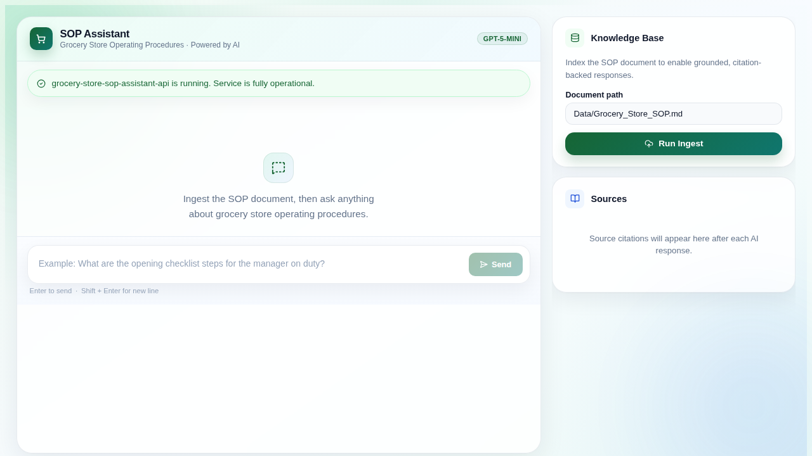
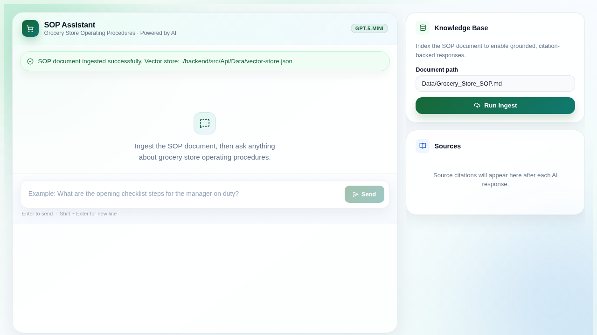
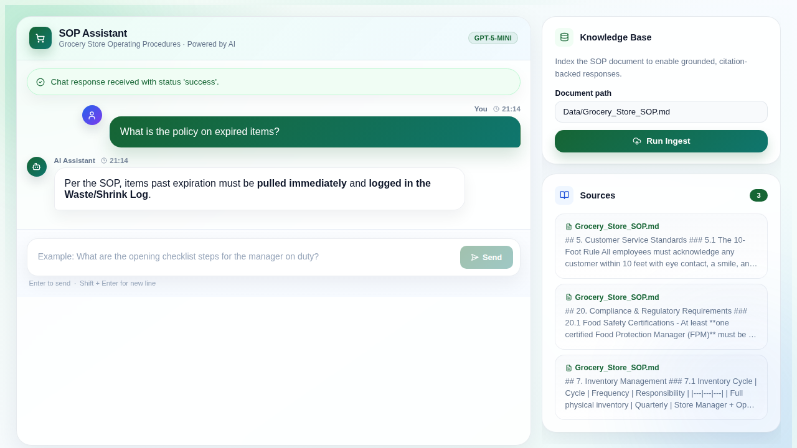
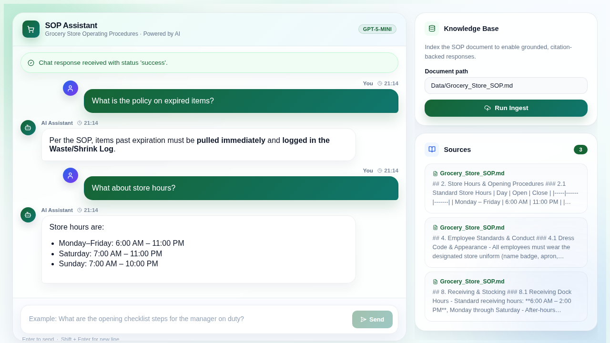

# Grocery Store SOP Assistant - Vertical Slice

This project is a Proof of Concept (POC) for an internal chatbot for a grocery store chain, allowing employees to ask questions about operating procedures grounded in the store's SOP.

## Tech Stack

- **Backend:** .NET 10 Web API
- **Frontend:** React 19 + TypeScript + Vite
- **AI Integration:** Official OpenAI SDK for .NET
- **Vector Store:** JSON file (`vector-store.json`) — in-memory cosine similarity, no external DB
- **Environment:** Centralized \`.env\` management
- **Containerization:** Docker & Docker Compose
- **CI/CD:** GitHub Actions
- **Testing:** xUnit (Backend), Vitest (Frontend), Playwright (E2E)

## Quick Start

```bash
# 1. Install dependencies and copy .env files
./scripts/setup.sh

# 2. Add your OpenAI API key
#    Open .env and set OpenAI__ApiKey=<your-key>

# 3. Build and start the full stack
./scripts/build.sh
docker compose up -d
```

## Configuration

The project uses a central `.env` file at the root for configuration and secret management.

1. **Create your `.env` file** (done automatically by `setup.sh`):
   ```bash
   cp .env.example .env
   ```
2. **Set your OpenAI API Key:** Open `.env` and fill in `OpenAI__ApiKey`.

All services (Backend, Frontend, and Docker Compose) are pre-configured to read from this central file.

## Scripts

All scripts live in `scripts/` and are self-contained.

| Script | Purpose |
|---|---|
| `./scripts/setup.sh` | Copy `.env` files, `npm ci`, `dotnet restore` |
| `./scripts/format.sh` | Check formatting/linting (pass `--fix` to auto-correct) |
| `./scripts/test.sh [all\|backend\|frontend]` | Run unit tests |
| `./scripts/build.sh [all\|backend\|frontend]` | Build Docker images |
| `./scripts/docker.sh <up\|down\|restart\|logs\|status> [service]` | Manage the Docker Compose stack |
| `./scripts/e2e.sh [test\|evidence]` | Run Playwright e2e tests or generate evidence screenshots |


## Implemented Features

### 1. RAG (Retrieval-Augmented Generation)
- **Ingestion:** Automatically chunks the `Grocery_Store_SOP.md` by header sections and generates embeddings.
- **Retrieval:** Uses In-memory Cosine Similarity to find the top 3 relevant chunks for any query.
- **Grounding:** Injects retrieved context into the system prompt for accurate, cited answers.

### 2. AI Agent & Tool Calling
- **Models:** Uses OpenAI's most cost-efficient models: `gpt-5-mini` (Chat) and `text-embedding-3-small` (Embeddings).
- **Tools:** The assistant can autonomously decide to:
  - `get_store_hours`: Directly retrieve operating hours.
  - `search_sop`: Perform a deeper search in the vector store for missing context.

### 3. Production-Ready Patterns
- **Resilience:** Implemented **Polly** resilience pipelines with Exponential Backoff Retries and Timeouts for all AI calls.
- **Validation:** 
  - **Backend:** Data Annotations for strict DTO validation.
  - **Frontend:** **Zod** schema validation for all API requests.
- **Logging:** Structured logging for tracking ingestion and AI interaction events.
- **Health Checks:** Integrated API health monitoring.

### 4. Code Quality & Formatting
- **Linting:** ESLint + Prettier configured for the frontend.
- **Formatting:** `dotnet format` for the backend.
- **GitHub Actions:** Automated CI pipeline for linting, building, and testing on every PR.

## How to Run

### Docker (Recommended)
```bash
./scripts/setup.sh          # first-time setup
./scripts/docker.sh up      # build images and start stack
./scripts/docker.sh down    # stop stack
./scripts/docker.sh restart # rebuild and restart
./scripts/docker.sh logs    # tail logs (Ctrl-C to exit)
```

Optionally scope to a single service: `./scripts/docker.sh up backend`

Services:
- **Backend API** → `http://localhost:5181`
- **Frontend** → `http://localhost:5173`

### Local Development
1. **Backend:**
   ```bash
   cd backend/src/Api
   dotnet run
   ```
2. **Frontend:**
   ```bash
   cd frontend
   npm run dev
   ```

### Testing
```bash
./scripts/test.sh            # all tests
./scripts/test.sh backend    # dotnet test only
./scripts/test.sh frontend   # vitest only
```

### Format & Lint
```bash
./scripts/format.sh          # check only
./scripts/format.sh --fix    # auto-fix
```

The same script also checks the `e2e/` Playwright files.

### E2E Evidence (Screenshots/Video)
```bash
./scripts/e2e.sh             # run all e2e tests
./scripts/e2e.sh evidence    # generate evidence screenshots
```

## Visual Evidence

The following screenshots were captured from the current UI flow:









## Key Design Decisions
- **Markdown Chunking:** Splits by headers to preserve semantic context (e.g., keeping "Opening Procedures" together).
- **GPT-5-mini:** Selected for its high performance-to-cost ratio, ideal for internal business tools.
- **JSON Vector Store:** In-memory vector store backed by `vector-store.json` — no external DB required, fully portable.
