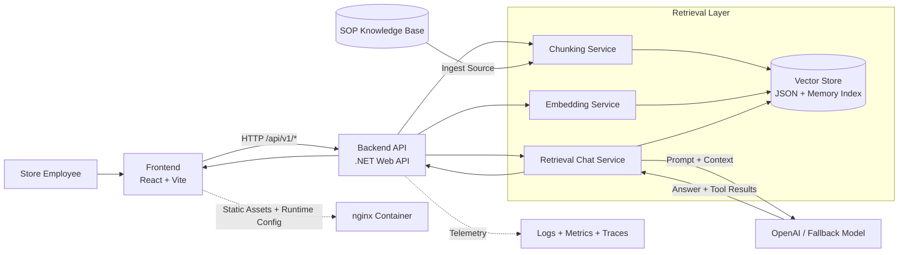
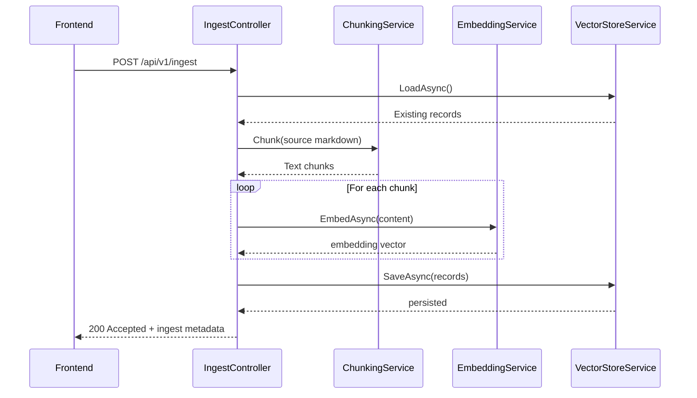
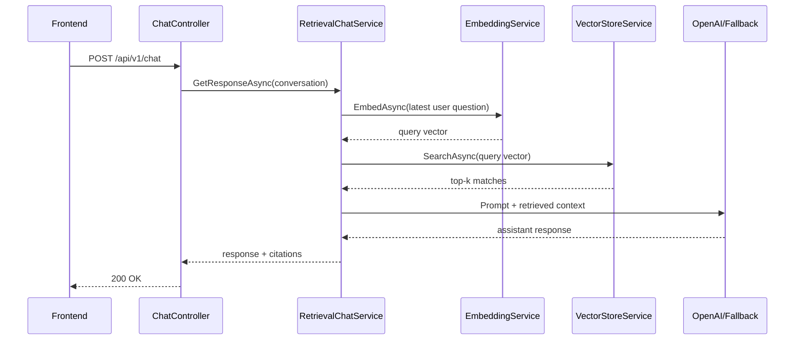

# Request Flows

## Architecture Diagram

```mermaid
flowchart LR
    U[Store Employee] --> FE[Frontend<br/>React + Vite]
    FE -->|HTTP /api/v1/*| BE[Backend API<br/>.NET Web API]

    subgraph Retrieval[Retrieval Layer]
        CH[Chunking Service]
        EMB[Embedding Service]
        RAG[Retrieval Chat Service]
        VS[(Vector Store<br/>JSON + Memory Index)]
    end

    BE --> CH
    BE --> EMB
    BE --> RAG
    CH --> VS
    EMB --> VS
    RAG --> VS

    RAG -->|Prompt + Context| LLM[OpenAI / Fallback Model]
    LLM -->|Answer + Tool Results| RAG
    RAG --> BE
    BE --> FE

    SOP[(SOP Knowledge Base)] -->|Ingest Source| CH

    BE -. Telemetry .-> OBS[Logs + Metrics + Traces]
    FE -. Static Assets + Runtime Config .-> NGINX[nginx Container]
```

## Ingest Flow

```mermaid
sequenceDiagram
    participant UI as Frontend
    participant API as IngestController
    participant CH as ChunkingService
    participant EMB as EmbeddingService
    participant VS as VectorStoreService

    UI->>API: POST /api/v1/ingest
    API->>VS: LoadAsync()
    VS-->>API: Existing records
    API->>CH: Chunk(source markdown)
    CH-->>API: Text chunks
    loop For each chunk
        API->>EMB: EmbedAsync(content)
        EMB-->>API: embedding vector
    end
    API->>VS: SaveAsync(records)
    VS-->>API: persisted
    API-->>UI: 200 Accepted + ingest metadata
```

## Chat Flow

```mermaid
sequenceDiagram
    participant UI as Frontend
    participant API as ChatController
    participant RAG as RetrievalChatService
    participant EMB as EmbeddingService
    participant VS as VectorStoreService
    participant LLM as OpenAI/Fallback

    UI->>API: POST /api/v1/chat
    API->>RAG: GetResponseAsync(conversation)
    RAG->>EMB: EmbedAsync(latest user question)
    EMB-->>RAG: query vector
    RAG->>VS: SearchAsync(query vector)
    VS-->>RAG: top-k matches
    RAG->>LLM: Prompt + retrieved context
    LLM-->>RAG: assistant response
    RAG-->>API: response + citations
    API-->>UI: 200 OK
```
