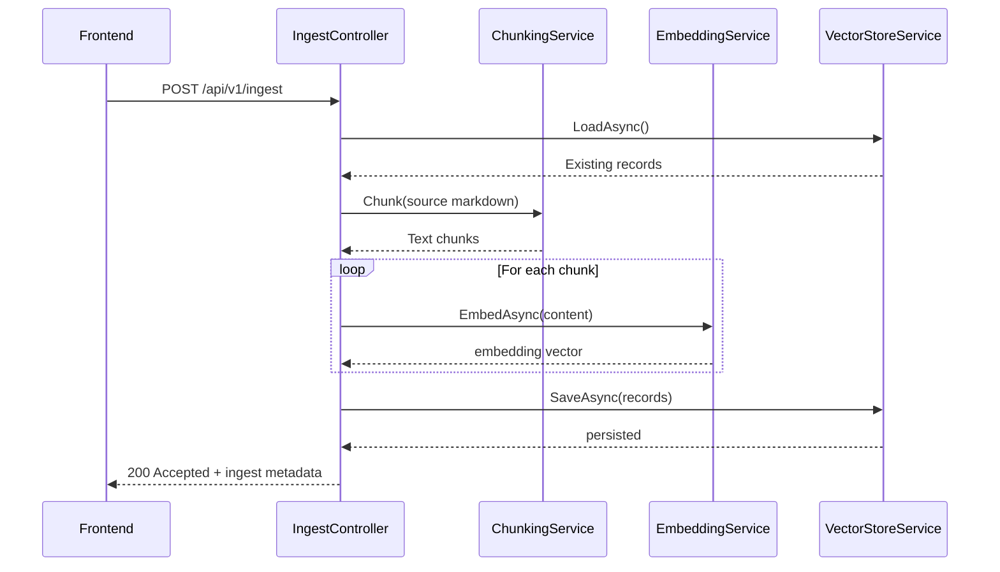
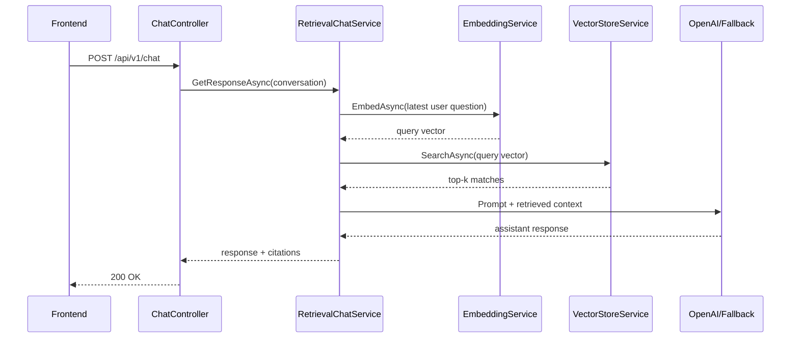

# Request Flows

## Ingest Flow

```mermaid
sequenceDiagram
    participant UI as Frontend
    participant API as IngestController
    participant CH as ChunkingService
    participant EMB as EmbeddingService
    participant VS as VectorStoreService

    UI->>API: POST /api/v1/ingest
    API->>VS: LoadAsync()
    VS-->>API: Existing records
    API->>CH: Chunk(source markdown)
    CH-->>API: Text chunks
    loop For each chunk
        API->>EMB: EmbedAsync(content)
        EMB-->>API: embedding vector
    end
    API->>VS: SaveAsync(records)
    VS-->>API: persisted
    API-->>UI: 200 Accepted + ingest metadata
```

## Chat Flow

```mermaid
sequenceDiagram
    participant UI as Frontend
    participant API as ChatController
    participant RAG as RetrievalChatService
    participant EMB as EmbeddingService
    participant VS as VectorStoreService
    participant LLM as OpenAI/Fallback

    UI->>API: POST /api/v1/chat
    API->>RAG: GetResponseAsync(conversation)
    RAG->>EMB: EmbedAsync(latest user question)
    EMB-->>RAG: query vector
    RAG->>VS: SearchAsync(query vector)
    VS-->>RAG: top-k matches
    RAG->>LLM: Prompt + retrieved context
    LLM-->>RAG: assistant response
    RAG-->>API: response + citations
    API-->>UI: 200 OK
```
